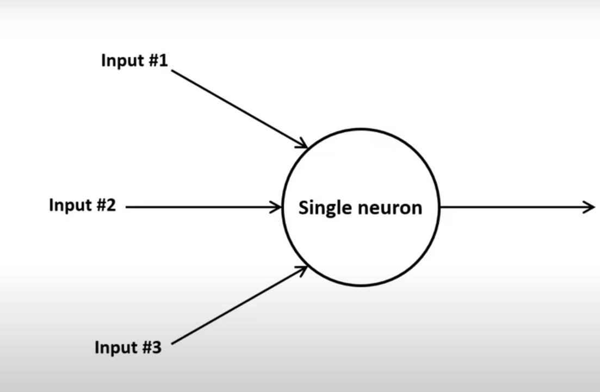

## Neuron

A single neuron

is a building block for neural network

## Black Box

It is a black box

That inputs some values,
and produces some results.

The special thing with this black box is:
- it can learn
- if it gives wrong value, and we show it original value
- it understands which input is more important and which is less
- based on that, it adjusts the imporantces of inputs and learn
- finally it predicts right value