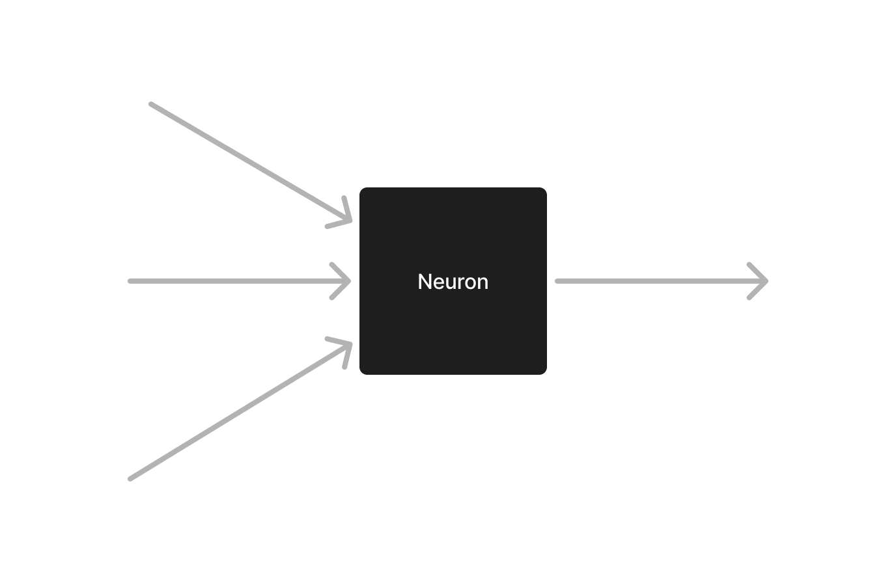
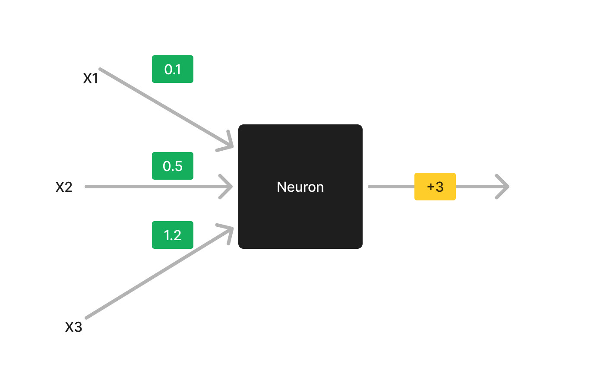
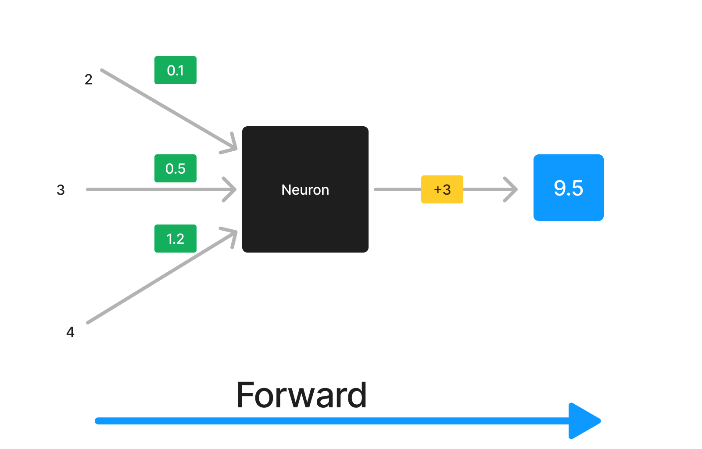
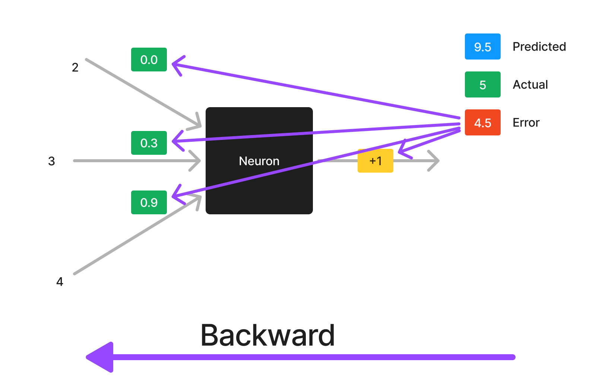
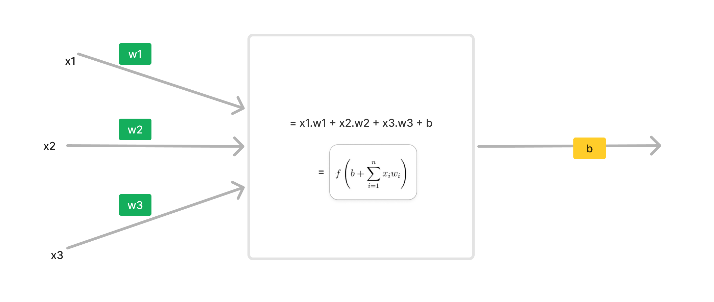

## Basics of Black Box

We konw what this black box do,
let us see how it does that

## Weights and Bias

Neuron has two values:
- weights: importance of every input
- bias: shifting the output a bit

in above picture:
- x1, x2 and x3 are three inputs
- 0.1, 0.5 and 1.2 are their weights where `0.5` means this input is 50% imporant.
- after adding inputs with their importances, it shifts the output by `+3`. it is bias value. (yellow)

## How it Improves

Neuron Learns by two steps:

1. __Forward-Pass__: given inputs, it predicts output

2. __Backward-Pass__: it calculates how much "wrong" is output, then it fixes all the weights and bias accordingly.

step 1 and 2 repreat for many values. and finally the neuron gets trained. (during **training**)

After that, only forward pass is used for prediction (during **testing** and using the model).

## The Black Box: Forward Pass

Let us make this black box white

We just multiply all inputs with their respective weights, and add bias in forward pass

## The Black Box: Backward Pass

see [next-file](./3-backward.md)