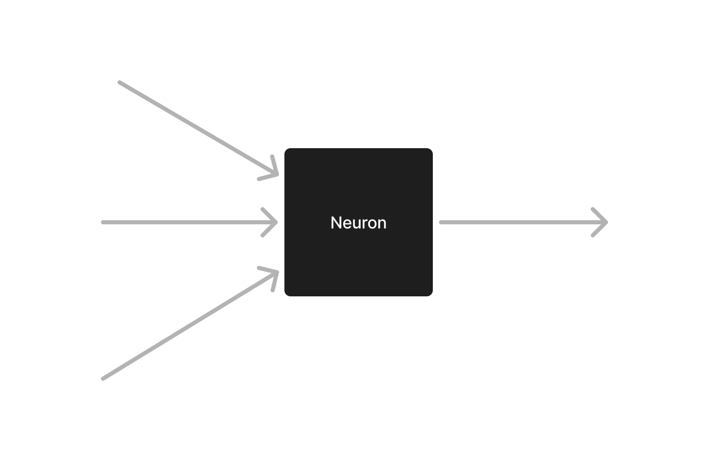
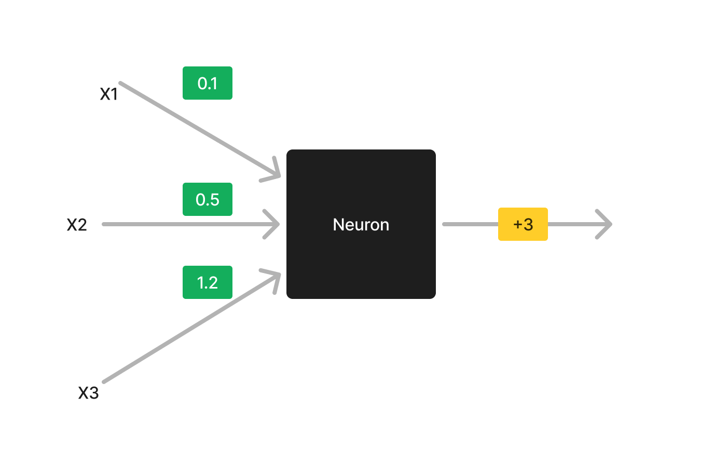
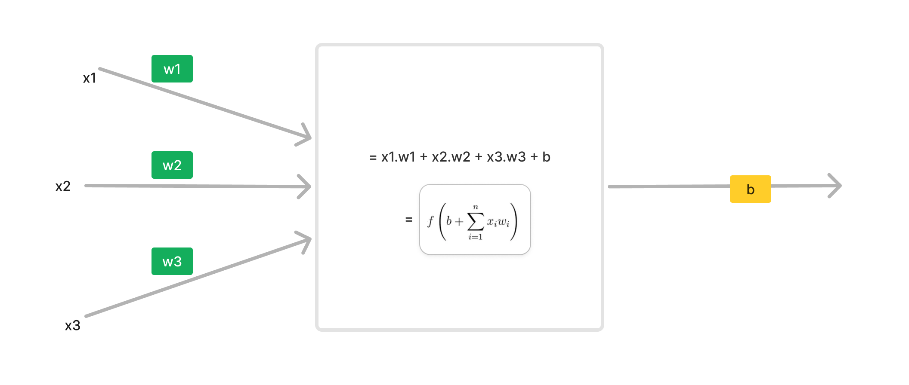

# Neuron

A single neuron

is a building block for neural network

## Black Box

It is a black box

That inputs some values,
and produces some results.

The special thing with this black box is:
- it can learn
- if it gives wrong value, and we show it original value
- it understands which input is more important and which is less
- based on that, it adjusts the imporantces of inputs and learn
- finally it predicts right value

## Basics of Black Box

We konw what this black box do,
let us see how it does that

## Weights and Bias

Neuron has two values:
- weights: importance of every input
- bias: shifting the output a bit

in above picture:
- x1, x2 and x3 are three inputs
- 0.1, 0.5 and 1.2 are their weights where `0.5` means this input is 50% imporant.
- after adding inputs with their importances, it shifts the output by `+3`. it is bias value. (yellow)

## How it Improves

Neuron Learns by two steps:

1. __Forward-Pass__: given inputs, it predicts output

2. __Backward-Pass__: it calculates how much "wrong" is output, then it fixes all the weights and bias accordingly.

step 1 and 2 repreat for many values. and finally the neuron gets trained. (during **training**)

After that, only forward pass is used for prediction (during **testing** and using the model).

## The Black Box: Forward Pass

Let us make this black box white

We just multiply all inputs with their respective weights, and add bias in forward pass

## Backward Pass

For going backwar and fixing weights and bias,

we need to follow some steps

## Steps

1. Error: find how bad result is
2. Loss: determine how wrongly did model punished. 
3. Gradient: for every weight, it determines how much 'fix' it needs for this loss
4. Updating Wegiths: how much should we change these weights for current loss

seems difficult ?

let us simplify it.

## 1. Error

We first need to find "error".
It is how wrong did model predicted.

take a look at following example

in first case, error = 1 eggs.

in second case, error = 6 eggs.

## 2. Loss

Loss means 'how much should we shout' based on error.

There are many [methods and techniques](../2-errors/README.md) used to calculate loss. But we shall use a simple method [Mean Sequared Error](../2-errors/1-mse/README.md)

This methods just chills for shorter errors.
Like for 1 egg, it still gives a win to Ezi. and gives a small number like 0.025

and punch weights to improve

But for bigger errors, e.g., 6 eggs, it shouts and gives a big number. 23.42

and punch weights a lot more to improve much more for this error

## 3. Gradient

with loss, we know that how much punches
we need to fix model

but it is time to distribute punches for individual weights.

inputs that were bigger, caused more bad results,
hance their weights will be punched more

and inputs that were smaller, deserve little fixing.

## 4. Update Weights

we know about all the punches.
but it is time for some math to see how these weights are actually fixed.

We determine Error and Loss.

And then distribute loss against every input.

and change weights according to loss. here is how result will look afterwards

but there is a problem, with this method, our model will never learn.

Its weights will keep jumping from very high positive values to vary low negative values and vice versa.

To make it "actually learn". we slow down this fixing process by "learning rate".
that means if learning rate is 0.1, it will only apply 10% of loss and slightly change weights.

this operation repeats for many samples until our Neuron is trained.