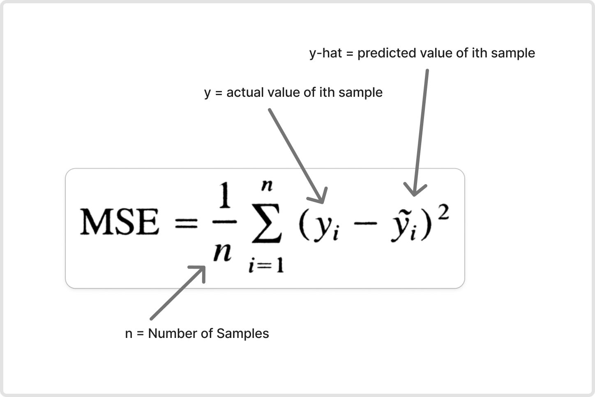
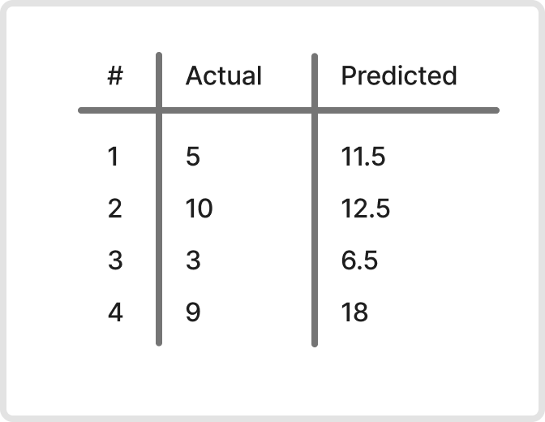
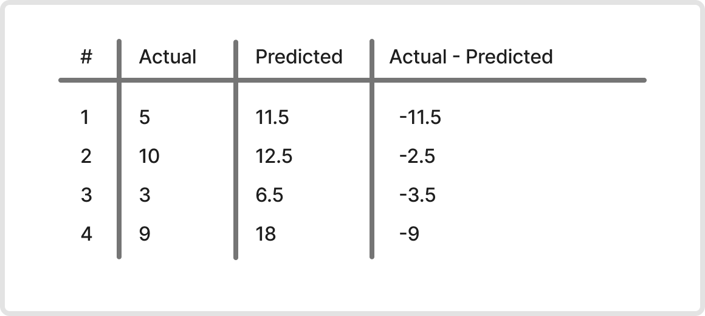
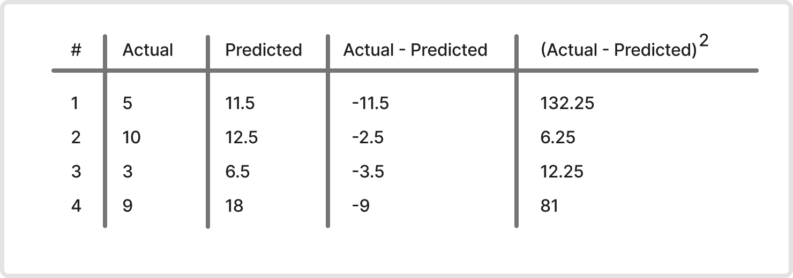
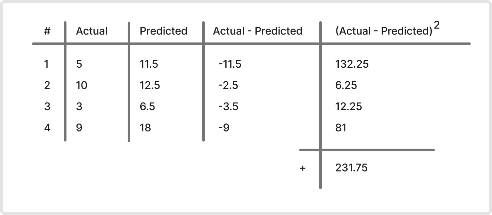

## Mean Squared Error

Here is formula of Mean Squared Error

and these are different variables in it:

## How to Use

If you have following results from a model:

You can just take difference of all

then take square of differences

now just add these squared differences

And divide it by number of samples

This is mean squared error result

## Take a look at ormula

Now if you take a look at formula again

You will understand how does this sigmoid works

