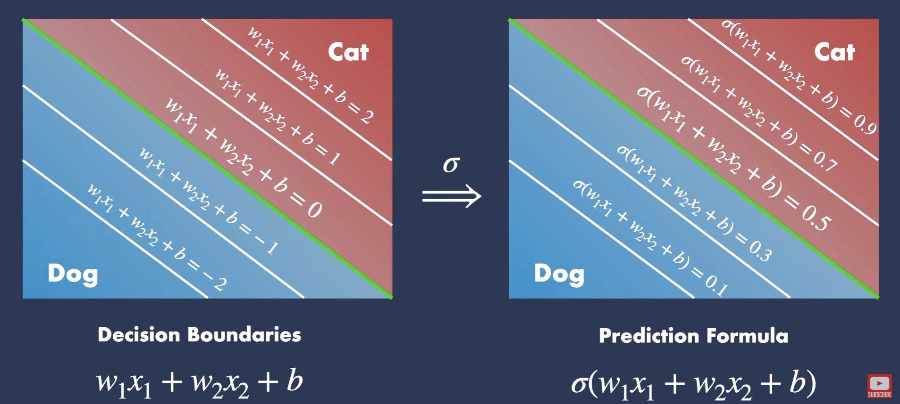

# Sigmoid

SIgmoid is a function,
that takes `x` and produces `y`

It givies:
- it quickly goes toward `0` when input is negative
- and it quickly goes close to `1` when input is positive.
- it gives output `0.5` when input is `0`

checkout more examples in [python file](./sigmoid.ipynb)

## Math

in simple words:
- it takes `2.71828`, and raise it to `input`.
- then it divides answer by one
- add one
- finally, again devide answer by one

it is just some math to produce above graph.

## Use

it is used to
1. divide things into 'two'
2. convert bigger and smaller values into a range of 0 and 1